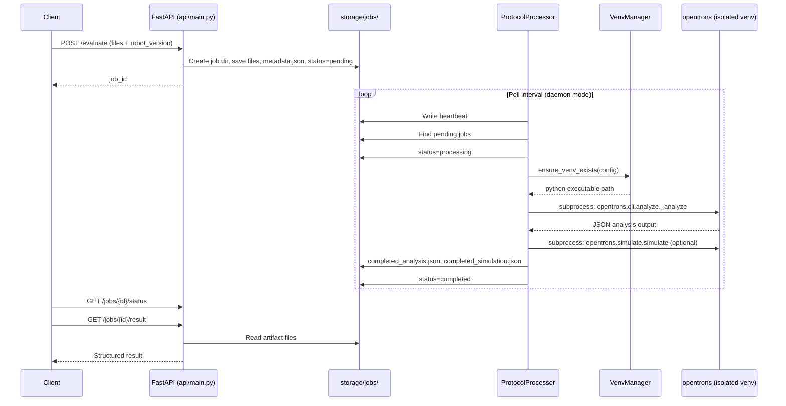

# Protocol Evaluation Architecture

Standalone Python service for analyzing Opentrons protocols against multiple Opentrons software versions or source revisions. This repository is the analysis engine only; protocol corpus testing, snapshot management, and reporting live in separate repositories (for example `private-protocol-testing`).

## Components

| Component | Path | Role |
|-----------|------|------|
| FastAPI server | `api/main.py` | HTTP API: upload protocols, query job status and results |
| Processor service | `evaluate/processor.py` | Background worker that runs analysis and simulation |
| Environment manager | `evaluate/venv_manager.py` | Creates and reuses isolated Opentrons virtual environments |
| Environment config | `evaluate/env_config.py` | Maps target versions to Python version and install specs |
| Job storage | `api/file_storage.py`, `evaluate/job_status.py` | Filesystem-backed job queue and status |
| HTTP client | `client/evaluate_client.py` | Sync and async clients for the REST API |
| Processor heartbeat | `evaluate/processor_heartbeat.py` | Lets `/ready` report processor liveness |

## Public API

### HTTP endpoints

| Method | Path | Purpose |
|--------|------|---------|
| `GET` | `/info` | Engine version, protocol API mappings, supported robot versions |
| `GET` | `/ready` | API up plus processor heartbeat freshness |
| `POST` | `/evaluate` | Submit protocol files for async evaluation |
| `GET` | `/jobs/{job_id}/status` | Job state (`pending`, `processing`, `completed`, `failed`) |
| `GET` | `/jobs/{job_id}/result` | Analysis or simulation artifact (`?result_type=analysis\|simulation`) |

### CLI entry points

| Command | Purpose |
|---------|---------|
| `uv run fastapi dev api/main.py` | Run API in development mode |
| `uv run uvicorn api.main:app` | Run API in production mode |
| `uv run python run_processor.py` | Run processor daemon (default) |
| `uv run python run_processor.py --mode once` | Process pending jobs once and exit |
| `make run`, `make run-api`, `make run-processor` | Makefile wrappers |

There is no in-process `evaluate_protocol()` Python API yet. Callers use the HTTP API or `EvaluationClient` / `AsyncEvaluationClient`.

## Evaluation flow



## Environment management

### Identity

Each supported target maps to a fixed environment name in `evaluate/env_config.py` (for example `opentrons-8.7.0`, `opentrons-edge`). Virtual environments live under `.venvs/{name}/`.

### Creation

1. `VenvManager.ensure_venv_exists()` checks whether `.venvs/{name}/bin/python` exists.
2. If missing or invalid, `uv venv --python {version}` creates the environment (falls back to `python -m venv` only when the requested version matches the base interpreter).
3. Packages install via `pip install` in order from `install_specs`.

### Cache reuse and validation

- Existing venvs are reused when the Python binary is usable (`import encodings`).
- Recreated when Python major.minor mismatches config, stdlib import fails, or `opentrons` is not importable.
- CI restores `.venvs/` from GitHub Actions cache keyed on `uv.lock` and `evaluate/env_config.py`.

### Gaps (planned)

- No file locking for concurrent venv creation
- No explicit force-rebuild flag
- No recorded resolved Git commit SHA in environment metadata
- No support for arbitrary Git refs (only hardcoded `edge` branch today)

## Opentrons version selection

`robot_version` on `/evaluate` selects an entry from `ENVIRONMENT_CONFIGS`:

| Target type | Examples | Install method |
|-------------|----------|----------------|
| Released package | `8.7.0`, `6.2.1` | `pip install opentrons=={version}` |
| Alpha alias | `next` | Pinned alpha on PyPI (`opentrons==8.8.0a13`) |
| Git branch | `edge` | `git+https://github.com/Opentrons/opentrons.git@edge#subdirectory=...` |

`api/version_mapping.py` maps protocol API versions (2.20 through 2.28) to these targets for `/info`.

## Analysis execution

The processor runs analysis in a subprocess using the target venv's Python:

```python
from opentrons.cli.analyze import _analyze, _Output
asyncio.run(_analyze(files, rtp_values, rtp_files, outputs, False, False, False))
```

This uses Opentrons' internal `_analyze` function (not the `opentrons analyze` CLI). Output is JSON written to a `BytesIO` stream, then wrapped with engine metadata.

Simulation uses `opentrons.simulate.simulate` in a separate subprocess. Simulation is skipped when RTP overrides or CSV runtime parameters are present.

### Timeouts and subprocess handling

- Analysis and simulation timeout: 120 seconds each (`ANALYSIS_TIMEOUT` in `processor.py`)
- Subprocess calls are synchronous (`subprocess.run`), blocking the processor thread
- Warm-up uses `ThreadPoolExecutor` for parallel venv creation at startup

## Job storage layout

```
storage/jobs/{job_id}/
  metadata.json          # robot_version, created_at, optional rtp/csv_file
  status.json            # status, updated_at, optional error
  {protocol}.py
  labware/*.json
  {data}.csv             # optional
  completed_analysis.json
  completed_simulation.json

storage/jobs/_processor_heartbeat.json   # processor liveness
```

## Result and error models

Results are loosely typed dictionaries today:

- Job-level: `status.json` with `pending | processing | completed | failed`
- Analysis artifact: `status: success | error`, `analysis`, `metadata`, optional `logs`
- Simulation artifact: `status: success | error | skipped`

Failures are not classified into a formal error taxonomy. Infrastructure failures (venv install, timeout) and protocol analysis failures share similar `status: error` shapes.

## Concurrency model

- API handles concurrent uploads (FastAPI async handlers, sync file I/O).
- Processor runs jobs sequentially within a single `run_once()` loop.
- Venv warm-up parallelizes across versions with `ThreadPoolExecutor`.
- No explicit job concurrency limit or async subprocess execution.

## Security boundaries

- No authentication on the HTTP API (intended for local or trusted network use).
- Git installs pull from public `github.com/Opentrons/opentrons` (no credentials in repo).
- Temporary paths and `python_path` appear in result metadata (leak into stable output).
- Secrets must not be committed; `.env` is gitignored.

## Test layers

| Layer | Path | Requires services | Speed |
|-------|------|-------------------|-------|
| Unit | `tests/unit/` | No | Fast |
| Integration | `tests/integration/` | No (TestClient) | Fast |
| E2E | `tests/e2e/` | Yes (API + processor) | Slow |

## Dependency tooling

- **Runtime**: Python 3.12+, FastAPI, python-multipart
- **Dev**: pytest, pytest-asyncio, httpx, ruff
- **Package manager**: uv (`uv sync`, `uv run`)
- **Analysis venvs**: uv for creation, pip for Opentrons installs
